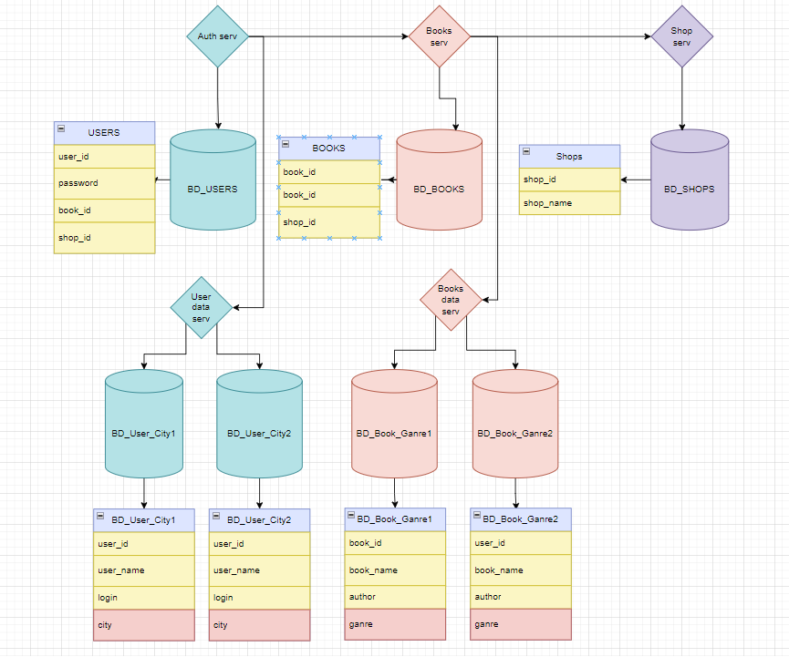

# ` Домашнее задание к занятию 12.7. «Репликация и масштабирование. Часть 2» - Борисов Александр`

## Задание 1 Опишите основные преимущества использования масштабирования методами:

### активный master-сервер и пассивный репликационный slave-сервер;
`Повышается надежность системы. Уменьшается вероятность потери данных (данные дублируются). Повышается скорость работы с данными (часть пользователей которым не нужно писать в БД могут работать с slave сервером)`

### master-сервер и несколько slave-серверов;
`Повышается надежность системы. Уменьшается вероятность потери данных (данные дублируются). Повышается скорость работы с данными (часть пользователей которым не нужно писать в БД могут работать с slave сервером). На сколько я понял все тоже самое что и с одним слэйвом, только тут больше возможностей для увеличения производительности и отказоустойчивости системы.`

### активный сервер со специальным механизмом репликации — distributed replicated block device (DRBD);
`Я так понял этот вариант может быть как primary-secondary так и primary-primary со всеми вытекающими плюсами и минусами. Фишка DRDB это работа с блочнами устройствами. Если я правильно понял это что-то типа raid массивов которые реплицируется на разных узлах`

### SAN-кластер.
`Сан кластер, это группа нод которые подключаются к одному хранилищу данных (SAN), в связи с этим эта система должна легко маштабироваться, большая отказоустойчивость, большая производительность, ну и чем больше серверов, тем больше производительность`

## Задание 2 Разработайте план для выполнения горизонтального и вертикального шаринга базы данных. База данных состоит из трёх таблиц:

### 1) пользователи,
### 2) книги,
### 3) магазины (столбцы произвольно).

`1) Я бы предложил в качестве вертикального шардирования разделить таблицы пользователи, книги и магазины на три БД`
`2) В качестве горизонтального шардирования разделить данные по пользователям в зависимости от города пользователя на БД или портиционировать в несколько таблиц по этому критерию`
`3) В качестве горизонтального шардирования в зависимости от жанра я бы разбил данные таблицы книги на несколько баз либо потиционировать их на несколько таблиц`
`4) БД с Магазинами я бы не стал разделять, я не думаю что их много. Да и если честно и выносить их в отдельную БД и смысла то не было больного` 
`5) Всю эту красоту либо расположить в кластере Master-Slave либо каждую БД раскидать в отдельный кластер (если необходимо для увеличения производительности и позволяют финансы)`

## Задание * Выполните настройку выбранных методов шардинга из задания 2.

### Пришлите конфиг Docker и SQL скрипт с командами для базы данных.

` попробую в выходные сделать.`
